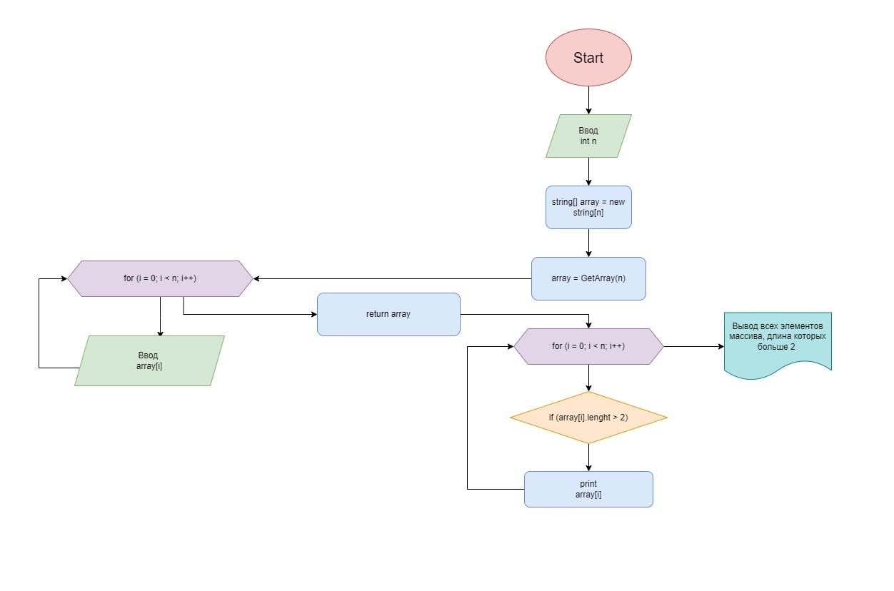

### Данная программа может выделить из заданного массива строк все элементы, которые содержат не более 3 символов.
1. Для этого пользователь сначала вводит нужное количество элементов. Программа создает массив строк, состоящий из заданного количества элементов.
2. Далее пользователь вводит элементы массива. В конце ранее созданный массив оказывается заполненным заданными строками.
3. Затем программа проверяет каждый элемент массива на количество строк, и выводит только те, что содержат 3 или менее символов.

Ниже приведена блок-схема представленной программы

